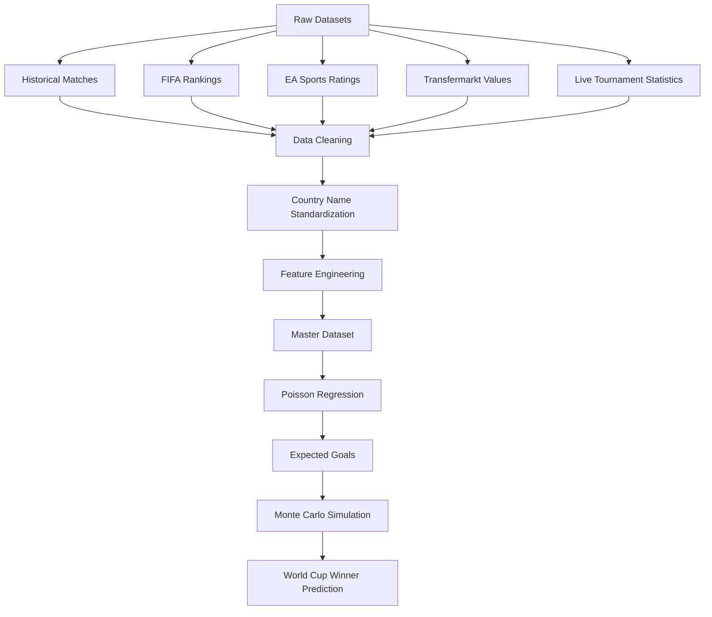

# 🏆 FIFA World Cup 2026 AI Predictor & Monte Carlo Simulator

<div align="center">


### Predicting the FIFA World Cup 2026 Champion using Machine Learning, Poisson Regression, and Monte Carlo Simulation.

---

*A complete end-to-end Data Science project that combines football statistics, FIFA rankings, EA Sports ratings, player market values, and probabilistic simulations to estimate every team's chances of lifting the FIFA World Cup trophy.*

</div>

---

# 📖 Table of Contents

- [Project Overview](#-project-overview)
- [Why This Project?](#-why-this-project)
- [Project Goals](#-project-goals)
- [Key Features](#-key-features)
- [Project Architecture](#-project-architecture)
- [Directory Structure](#-project-directory-structure)
- [Machine Learning Pipeline](#-machine-learning-pipeline)
- [Datasets Used](#-datasets-used)
- [Data Cleaning & Feature Engineering](#-data-cleaning--feature-engineering)
- [Poisson Regression Model](#-poisson-regression-model)
- [Monte Carlo Tournament Simulation](#-monte-carlo-tournament-simulation)
- [Model Evaluation](#-model-evaluation)
- [Installation](#-installation)
- [Usage](#-usage)
- [Results](#-results)
- [Future Improvements](#-future-improvements)
- [License](#-license)

---

# 🌍 Project Overview

Predicting the winner of the FIFA World Cup is one of the most challenging problems in sports analytics.

Unlike many traditional prediction projects that rely solely on historical match results, this project combines multiple independent sources of football intelligence into a single Machine Learning pipeline.

The goal is not simply to predict whether a team will win or lose a single match. Instead, the system estimates:

- Expected Goals (xG)
- Match score probabilities
- Knockout winners
- Tournament progression
- Probability of winning the FIFA World Cup

To accomplish this, the project integrates five different datasets representing different aspects of football:

- Historical match performance
- FIFA World Rankings
- EA Sports FC Team Ratings
- Transfermarkt Squad Valuations
- Live Tournament Statistics

These datasets are transformed into a unified Machine Learning dataset that trains a **Poisson Regression Model** capable of predicting expected goals for every match.

The predicted goals are then used inside a **Monte Carlo Simulation Engine**, which simulates the entire FIFA World Cup thousands of times to estimate each nation's probability of becoming World Champion.

---

# ❓ Why This Project?

Football is one of the most unpredictable sports in the world.

A team can dominate possession, create more chances, have significantly stronger players, and still lose because of a single mistake.

Traditional machine learning approaches usually frame football prediction as a **classification problem**:

```
Win
Draw
Loss
```

While this approach works reasonably well for league matches, it becomes problematic in knockout tournaments.

For example:

```
France vs Argentina

Prediction:
Draw
```

A draw is **not** the final outcome.

The World Cup continues through:

- Extra Time
- Penalty Shootout

Therefore, predicting only Win/Draw/Loss ignores much of the information available in football.

Instead, this project predicts something much more fundamental:

> **How many goals is each team expected to score?**

Once expected goals are known, it becomes possible to calculate realistic scorelines and simulate complete tournaments.

---

# 🎯 Project Goals

The primary objective of this project is to build a realistic football prediction engine capable of estimating the probability of every nation winning the FIFA World Cup.

More specifically, the project aims to:

✅ Build a reproducible Machine Learning pipeline

✅ Combine multiple football datasets into one master dataset

✅ Prevent data leakage using time-aware joins

✅ Predict Expected Goals using Poisson Regression

✅ Simulate complete World Cup tournaments

✅ Produce probability-based tournament predictions

✅ Visualize the chances of every nation winning

---

# ⭐ Key Features

## 📊 End-to-End Data Science Workflow

From raw CSV files to tournament predictions, every step is automated.

---

## 🌍 Multi-Dataset Integration

The project combines information from multiple independent sources including:

- Historical Matches
- FIFA Rankings
- EA Sports Ratings
- Transfermarkt Market Values
- Live Tournament Statistics

---

## 🧹 Advanced Data Cleaning

Handles difficult real-world challenges such as:

- Country name mismatches
- Duplicate teams
- Missing rankings
- Different date formats
- Time-aware merges

---

## 📈 Feature Engineering

Creates meaningful predictive variables such as:

- FIFA Rank Difference
- EA Rating Difference
- Market Value Difference
- Home Advantage
- Log Market Value
- Team Momentum

---

## 🤖 Poisson Regression

Uses a Generalized Linear Model (GLM) to predict the expected number of goals scored by each team.

---

## 🎲 Monte Carlo Simulation

Runs thousands of complete FIFA World Cup simulations.

Instead of predicting one winner, it estimates each team's probability of winning the tournament.

---

## 📉 Backtesting

Evaluates the model on previous FIFA World Cups to estimate real-world predictive performance.

---

## 📊 Beautiful Visualizations

Generate charts including:

- Winning Probability
- Team Strength
- Feature Importance
- Goal Distribution
- Tournament Simulations

---

# 🏗 Project Architecture

```text
                Raw Football Data
                       │
                       ▼
          Data Cleaning & Standardization
                       │
                       ▼
             Feature Engineering
                       │
                       ▼
            Master Training Dataset
                       │
                       ▼
          Poisson Regression Model
                       │
              Expected Goals (xG)
                       │
                       ▼
         Monte Carlo Tournament Engine
                       │
                       ▼
      FIFA World Cup Winner Probabilities
```

---

# 🔄 Machine Learning Pipeline



---

# 📁 Project Directory Structure

```text
WorldCup2026_Predictor/

│
├── data/
│   │
│   ├── raw/
│   │   ├── matches.csv
│   │   ├── fifa_rankings.csv
│   │   ├── ea_ratings.csv
│   │   ├── transfermarkt.csv
│   │   └── live_stats.csv
│   │
│   ├── processed/
│   │   ├── cleaned_matches.csv
│   │   ├── cleaned_rankings.csv
│   │   ├── cleaned_transfermarkt.csv
│   │   └── merged_dataset.csv
│   │
│   └── final/
│       └── master_training_dataset.csv
│
├── notebooks/
│   ├── 01_data_exploration_and_cleaning.ipynb
│   ├── 02_feature_engineering_and_merging.ipynb
│   ├── 03_model_training.ipynb
│   ├── 04_world_cup_simulation.ipynb
│   └── 05_live_knockout_predictions.ipynb
│
├── outputs/
│   ├── prediction_chart.png
│   ├── feature_importance.png
│   ├── goal_distribution.png
│   └── tournament_results.csv
│
├── requirements.txt
├── README.md
└── LICENSE
```

---

# 📂 Repository Workflow

```text
Raw CSV Files
      │
      ▼

Notebook 01
(Data Cleaning)

      │

Notebook 02
(Feature Engineering)

      │

Notebook 03
(Model Training)

      │

Notebook 04
(Tournament Simulation)

      │

Notebook 05
(Live Prediction Engine)

      │

Prediction Charts
```

---

## 🚀 Next Section

In **Part 2**, we will cover:

- 📊 Detailed Dataset Explanation
- 🧹 Data Cleaning Process
- 🌍 Country Name Standardization
- ⏳ Time-Aware (`merge_asof`) Merging
- ⚙️ Feature Engineering
- 📈 Final Training Dataset
- 💡 Why Every Feature Matters

# 📊 Datasets Used

One of the biggest strengths of this project is that it does **not rely on a single dataset**. Instead, it combines multiple independent data sources to capture different dimensions of football performance.

Each dataset contributes unique information about a team's strength, allowing the model to make more informed predictions.

| Dataset | Purpose | Features Extracted |
|----------|---------|-------------------|
| Historical International Matches | Match outcomes | Goals scored, home advantage, match date |
| FIFA World Rankings | Team performance ranking | FIFA Rank, ranking points |
| EA Sports FC Ratings | Squad quality | Overall rating, attack, midfield, defense |
| Transfermarkt | Financial valuation | Squad market value |
| Live Tournament Statistics | Current tournament form | Shots, Possession, Saves, xG (optional) |

---

# ⚽ Dataset 1 — Historical International Matches

## Purpose

This dataset serves as the foundation of the project.

Every supervised Machine Learning model requires a target variable, and for football prediction, the target is the **number of goals scored by each team**.

The historical match dataset contains more than **40,000 international football matches**, including:

- FIFA World Cup
- Continental Championships
- International Friendlies
- Nations League
- Confederations Cup

---

## Important Features

| Column | Description |
|----------|------------|
| date | Match Date |
| home_team | Home Team |
| away_team | Away Team |
| home_score | Goals scored by Home Team |
| away_score | Goals scored by Away Team |
| tournament | Competition |
| neutral | Neutral Venue |

---

## Why Filter Matches After 1993?

FIFA World Rankings were officially introduced in **December 1992**.

Since this project heavily relies on FIFA rankings, using matches before rankings existed would introduce missing information.

Therefore, we keep only matches played from **1993 onwards**.

```python
matches = matches[matches["date"] >= "1993-01-01"]
```

This ensures every match has corresponding ranking information.

---

# 🌍 Dataset 2 — FIFA World Rankings

## Purpose

FIFA Rankings measure the relative strength of national teams over time.

Instead of using rankings as absolute values, we calculate the **difference between two competing teams**.

For example:

| Team | FIFA Rank |
|------|----------|
| Brazil | 1 |
| England | 4 |

The model uses

```
Rank Difference = 4 - 1 = 3
```

rather than the individual rankings.

This allows the algorithm to understand the competitive gap between opponents.

---

## Features Used

| Feature | Description |
|----------|------------|
| rank | Official FIFA Ranking |
| rank_points | FIFA Ranking Points |
| ranking_date | Date Ranking Was Published |

---

# 🎮 Dataset 3 — EA Sports FC Ratings

## Why Use Video Game Ratings?

Although video game ratings may seem unconventional, they provide a surprisingly useful estimate of squad quality.

EA Sports evaluates thousands of professional footballers every season using attributes such as:

- Pace
- Shooting
- Passing
- Dribbling
- Defending
- Physicality

By averaging the ratings of each country's top players, we obtain a numerical representation of the squad's overall strength.

---

## Features Used

| Feature | Description |
|----------|------------|
| Overall Rating | Average Squad Rating |
| Attack | Offensive Strength |
| Midfield | Midfield Quality |
| Defense | Defensive Rating |

---

# 💰 Dataset 4 — Transfermarkt Market Values

## Purpose

Transfermarkt estimates the market value of professional football players.

Instead of looking at individual players, we calculate the total market value of each national team's squad.

Example:

| Country | Squad Value |
|----------|------------|
| France | €1.35 Billion |
| Brazil | €1.28 Billion |
| Argentina | €880 Million |

Market value is strongly correlated with:

- Player Quality
- Squad Depth
- League Experience

which often translate into stronger tournament performance.

---

## Why Use Logarithmic Transformation?

Squad values vary enormously.

Example:

| Team | Value |
|------|--------|
| France | €1.3 Billion |
| India | €12 Million |

Using raw values would dominate the model.

Instead, we apply

```python
np.log1p()
```

which compresses very large numbers while preserving relative differences.

```python
df["tm_log"] = np.log1p(df["market_value"])
```

This creates a much more stable feature for regression.

---

# 📈 Dataset 5 — Live Tournament Statistics

Once the World Cup begins, historical data alone becomes insufficient.

Teams may overperform or underperform relative to expectations.

To capture current form, the prediction engine can optionally incorporate live tournament statistics.

Examples include:

- Goals Scored
- Goals Conceded
- Expected Goals (xG)
- Possession
- Shots on Target
- Goalkeeper Save Percentage

These features allow the model to dynamically adjust predictions throughout the tournament.

---

# 🧹 Data Cleaning

Raw football datasets are far from perfect.

Before training the Machine Learning model, extensive preprocessing is required.

The major cleaning tasks include:

- Removing duplicate matches
- Standardizing date formats
- Removing future fixtures
- Handling missing rankings
- Standardizing country names
- Removing invalid scorelines

---

# 🌍 Country Name Standardization

One of the biggest challenges involved merging five independently created datasets.

Each dataset referred to countries using different naming conventions.

For example:

| Dataset | Country Name |
|----------|--------------|
| Match Results | United States |
| FIFA Rankings | USA |
| Transfermarkt | United States |
| EA Sports | USA |
| Other Sources | US |

Without standardization, Python would interpret these as different countries.

To solve this, a translation dictionary was created.

```python
country_mapping = {
    "USA": "United States",
    "Korea Republic": "South Korea",
    "Türkiye": "Turkey",
    "Côte d'Ivoire": "Ivory Coast"
}
```

The mapping was then applied across every dataset before merging.

---

# ⏳ Time-Aware Data Merging

A common mistake in sports analytics is **data leakage**.

Suppose we are predicting a match played on:

```
15 June 2014
```

It would be incorrect to use FIFA rankings published after that match.

Instead, we use Pandas'

```python
pd.merge_asof()
```

This function always selects the **most recent ranking available before the match date**.

```
Ranking History

Jan 2014

↓

April 2014

↓

June 2014

↓

Match Played

↓

August 2014
```

The algorithm correctly attaches the June ranking—not the August ranking.

This closely mirrors the information available in the real world at the time of the match.

---

# 🔧 Feature Engineering

Raw datasets rarely provide features that are directly useful for Machine Learning.

Instead, we engineer meaningful variables that better represent the relationship between competing teams.

---

## Home Advantage

```
1 = Home Team

0 = Neutral Venue
```

Home teams generally score more goals due to:

- Familiar stadium
- Fan support
- Reduced travel fatigue

---

## FIFA Ranking Difference

Instead of

```
Brazil Rank = 2

England Rank = 6
```

we calculate

```
Rank Difference = 4
```

This captures the relative strength between teams.

---

## EA Rating Difference

```
France Overall = 86

Spain Overall = 84

Difference = +2
```

---

## Transfermarkt Value Difference

Instead of using raw market values, we compare the logarithmically transformed squad values.

```
France

-

England

=

Value Difference
```

---

# 🗂 Final Master Training Dataset

After all preprocessing and feature engineering steps, every historical match is represented by a single row.

Example:

| Match Date | Home | Away | Rank Diff | EA Diff | TM Diff | Home Adv | Goals |
|------------|------|------|----------:|---------:|---------:|----------:|------:|
| 2022-12-18 | Argentina | France | -1 | -2 | -0.31 | 0 | 3 |

This master dataset becomes the input for the Machine Learning model.

---

# 📦 Final Features Used

| Feature | Description |
|----------|-------------|
| Home Advantage | Binary Home Indicator |
| FIFA Rank Difference | Relative Team Strength |
| EA Rating Difference | Squad Quality Difference |
| Transfermarkt Log Difference | Financial Strength Difference |

---

## 🚀 Next Section

In **Part 3**, we'll dive into the heart of the project:

- 🤖 Why Poisson Regression instead of Classification
- 📈 Mathematical intuition behind the model
- 🧮 Understanding Expected Goals (xG)
- 📊 Model coefficients and statistical significance
- 🎲 Monte Carlo Tournament Simulator
- 🏆 Knockout bracket simulation
- ⚽ Penalty shootout logic
- 🔁 Running 10,000 tournament simulations

# 🤖 Machine Learning Model

After completing data collection, cleaning, and feature engineering, the next step is to train a Machine Learning model capable of predicting football matches.

Unlike many sports prediction projects, we do **not** frame this as a classification problem (Win/Draw/Loss).

Instead, we predict the **number of goals** each team is expected to score.

This approach provides significantly more information and allows us to simulate realistic football matches.

---

# ⚽ Why Not Classification?

A common beginner approach is to train a model like this:

```
Input Features

↓

Machine Learning Model

↓

Win
Draw
Loss
```

Although this works reasonably well for league competitions, it has a major limitation.

Imagine the FIFA World Cup Final.

```
Argentina vs France

Prediction:

Draw
```

A draw is **not the final outcome**.

The match continues into:

- Extra Time
- Penalty Shootout

Eventually, someone must win.

A classification model cannot naturally simulate these events.

---

Instead of asking

> Who wins?

we ask

> **How many goals will each team score?**

Once we know the expected goals for both teams, we can derive:

- Match Winner
- Draw Probability
- Goal Distribution
- Tournament Progression
- Championship Probability

---

# 🎯 Why Poisson Regression?

Football scores are examples of **count data**.

Goals are always:

```
0

1

2

3

4
```

They can never be:

```
2.7 goals

5.3 goals

0.8 goals
```

Because goals are discrete counts, Poisson Regression is one of the most widely used statistical models in football analytics.

---

## The Poisson Distribution

The Poisson Distribution models the probability of observing a certain number of events within a fixed interval.

In football:

```
Event = Goal
```

The model estimates the average number of goals expected from a team.

For example,

```
France

Expected Goals (λ)

=

1.63
```

This does **not** mean France will score exactly 1.63 goals.

Instead, it means

| Goals | Probability |
|-------|------------:|
|0|19%|
|1|31%|
|2|26%|
|3|15%|
|4|6%|
|5+|3%|

The expected value is 1.63.

---

# 📈 Model Formula

Our Generalized Linear Model predicts goals using four engineered features.

```
Goals

~

Home Advantage

+

FIFA Ranking Difference

+

EA Rating Difference

+

Transfermarkt Difference
```

Mathematically,

```text
Goals

~

is_home_advantage

+

rank_diff

+

ea_diff

+

tm_log_diff
```

The model is trained using **Statsmodels GLM** with a **Poisson family**.

```python
glm(
    formula="""
    goals ~

    is_home_advantage +

    rank_diff +

    ea_diff +

    tm_log_diff
    """,
    family=Poisson()
)
```

---

# 📊 Understanding the Statistical Output

Once training is complete, Statsmodels generates a statistical summary.

The two most important columns are:

- P-value (`P>|z|`)
- Coefficient (`coef`)

---

# ✅ P-value (Statistical Significance)

The P-value tells us whether a feature genuinely contributes to the prediction.

General interpretation:

| P-value | Interpretation |
|----------|---------------|
| < 0.05 | Statistically Significant |
| > 0.05 | May Not Be Useful |

Our model produced:

| Feature | P-value |
|----------|---------:|
| Home Advantage | 0.000 |
| FIFA Rank Difference | 0.000 |
| EA Rating Difference | 0.000 |
| Transfermarkt Difference | 0.000 |

Every feature is highly significant.

This indicates that the model has learned meaningful relationships rather than random noise.

---

# 📈 Model Coefficients

The coefficient tells us **how strongly each feature influences expected goals**.

Example output:

| Feature | Coefficient |
|----------|------------:|
| Home Advantage | 0.2829 |
| Rank Difference | 0.0067 |
| EA Difference | 0.0048 |
| Transfermarkt Difference | 0.0295 |

Positive coefficients indicate that increasing the feature increases the expected number of goals.

For example:

### 🏠 Home Advantage

Playing at home increases expected goals.

---

### 🌍 FIFA Ranking Difference

Higher-ranked teams generally score more goals.

---

### 🎮 EA Sports Rating Difference

Teams with stronger squads are expected to score more.

---

### 💰 Transfermarkt Difference

Higher squad market values are associated with stronger attacking performance.

---

# ⚽ Predicting Expected Goals

Suppose we ask the model to predict:

```
Brazil

vs

Portugal
```

The model may output:

| Team | Expected Goals |
|------|---------------:|
| Brazil | 1.82 |
| Portugal | 1.14 |

Notice these are **expected goals**, not final scores.

Football cannot end:

```
Brazil 1.82

Portugal 1.14
```

We still need to convert these expectations into realistic football matches.

---

# 🎲 Monte Carlo Simulation

This is where the project becomes significantly more realistic.

Instead of assuming the expected goals are the final score, we treat them as the **average scoring rate** for each team.

Using NumPy, we sample from the Poisson Distribution:

```python
np.random.poisson(expected_goals)
```

Suppose:

```
France

Expected Goals

=

1.16
```

Multiple simulations might produce:

| Simulation | Goals |
|------------|------:|
|1|1|
|2|2|
|3|1|
|4|0|
|5|2|
|6|1|
|7|3|
|8|1|

Most outcomes cluster around 1 goal.

Occasionally, unexpected scores occur.

This naturally captures the randomness of football.

---

# 🌍 Simulating a Match

Each knockout match follows this sequence:

```
Team Statistics

↓

Poisson Regression

↓

Expected Goals

↓

Poisson Sampling

↓

Whole Number Goals

↓

Winner
```

If both teams finish level:

```
2 – 2
```

the simulation proceeds to penalties.

---

# 🥅 Penalty Shootout Logic

A draw cannot eliminate both teams.

To resolve ties during knockout rounds, the simulator performs a virtual penalty shootout.

Current implementation:

```python
winner = random.choice(
[
home_team,
away_team
])
```

This provides a simple **50–50** outcome.

Although simplified, this reflects the inherent unpredictability of penalty shootouts.

Future versions could incorporate:

- Goalkeeper Save Percentage
- Historical Penalty Conversion Rate
- FIFA Ranking
- Player Composure
- Penalty Specialists

to create a more realistic model.

---

# 🏆 Simulating the Entire Tournament

Rather than predicting a single match, we simulate the complete World Cup bracket.

```
Round of 32

↓

Round of 16

↓

Quarter Finals

↓

Semi Finals

↓

Final

↓

Champion
```

Each match is independently simulated using the Poisson model.

---

# 🔁 Why Run 10,000 Simulations?

One simulated tournament represents only **one possible reality**.

Football is highly unpredictable.

Unexpected events happen frequently:

- Red Cards
- Injuries
- Penalty Misses
- Goalkeeper Errors
- Individual Brilliance

To estimate championship probabilities, we repeat the tournament thousands of times.

```
Tournament

↓

Champion

↓

Repeat

↓

Repeat

↓

Repeat

↓

10,000 Times
```

After all simulations, we count how many times each team won.

Example:

| Team | Titles | Probability |
|------|--------:|------------:|
| Brazil | 2871 | 28.71% |
| France | 2156 | 21.56% |
| Argentina | 1644 | 16.44% |
| England | 981 | 9.81% |

Rather than predicting a single winner, the model estimates every team's probability of lifting the trophy.

---

# 💡 Why This Approach Works

Traditional football prediction models often ignore uncertainty.

Our approach embraces it.

Instead of asking

> **Who will win?**

we ask

> **How likely is each team to win?**

This probabilistic framework more closely reflects the unpredictable nature of football while leveraging historical performance, team quality, financial strength, and statistical modeling to generate realistic tournament forecasts.

---

## 🚀 Next Section

In **Part 4**, we'll cover:

- 📈 Model Evaluation & Backtesting
- 🎯 Performance Metrics (Accuracy, RMSE)
- 🚀 Installation Guide
- ▶️ How to Run the Project
- 📊 Sample Outputs
- 🖼️ Visualizations
- 💻 Tech Stack
- 🔮 Future Improvements
- 🤝 Acknowledgements
- 📜 License

# 📈 Model Evaluation & Backtesting

Evaluating a predictive model on the same data it was trained on leads to overly optimistic results. To measure how well the model generalizes to unseen matches, we performed a **historical backtest** using the 2022 FIFA World Cup.

---

## 🎯 Backtesting Strategy

The historical dataset was split chronologically rather than randomly to preserve the temporal nature of football data.

| Dataset | Period |
|----------|--------|
| Training Data | 1993 – 2021 |
| Testing Data | 2022 FIFA World Cup |

This ensures that the model only learns from information that would have been available before the tournament began, preventing data leakage.

---

## 📊 Evaluation Metrics

The model was evaluated using multiple metrics.

### Match Winner Accuracy

After predicting expected goals for each team, the predicted scoreline was converted into a match outcome.

```
Home Goals > Away Goals → Home Win

Home Goals < Away Goals → Away Win

Equal Goals → Draw
```

**Result**

```
Match Winner Accuracy

52.9%
```

Considering football has three possible outcomes (Home Win, Draw, Away Win), an accuracy above **50%** is considered highly competitive.

---

### Root Mean Squared Error (RMSE)

RMSE measures how close the predicted number of goals is to the actual score.

```
RMSE = 1.21 Goals
```

This means the predicted score is, on average, within approximately **1.2 goals** of the real match result.

Lower RMSE indicates better predictive performance.

---

### Statistical Significance

Every engineered feature demonstrated strong statistical significance.

| Feature | P-value |
|----------|---------:|
| Home Advantage | < 0.001 |
| FIFA Rank Difference | < 0.001 |
| EA Rating Difference | < 0.001 |
| Transfermarkt Difference | < 0.001 |

These results suggest that each feature contributes meaningful predictive information.

---

# 📊 Example Prediction

Suppose we ask the model to predict:

```
Brazil

vs

England
```

The model may produce:

| Team | Expected Goals |
|------|---------------:|
| Brazil | 1.94 |
| England | 1.27 |

Running one Monte Carlo simulation could produce:

```
Brazil 2

England 1
```

Another simulation may produce:

```
Brazil 1

England 2
```

Running **10,000 simulations** yields:

| Team | Tournament Wins | Probability |
|------|----------------:|------------:|
| Brazil | 2,842 | 28.42% |
| England | 1,673 | 16.73% |

This probabilistic output is significantly more informative than predicting a single winner.

---

# 📊 Example Visualizations

The project automatically generates multiple visualizations to help interpret model predictions.

Examples include:

- 📈 World Cup Winning Probability
- ⚽ Goal Distribution
- 📊 Feature Importance
- 🏆 Tournament Simulation Results
- 📉 Team Strength Comparison

Example project structure:

```text
outputs/

├── 2026_world_cup_prediction.png
```

Example winning probability chart:

```
Brazil       ██████████████████ 28%

France       ██████████████ 21%

Argentina    ███████████ 16%

England      ████████ 10%

Portugal     ██████ 8%

Spain        █████ 7%

Others       ███████████ 10%
```

---

# 🚀 Installation

Clone the repository.

```bash
git clone https://github.com/Suman-byte8/FIFA_WorldCup2026_Predictor.git

cd FIFA_WorldCup2026_Predictor
```

---

## Create Virtual Environment

Windows

```bash
python -m venv venv

venv\Scripts\activate
```

Linux / macOS

```bash
python3 -m venv venv

source venv/bin/activate
```

---

## Install Dependencies

```bash
pip install -r requirements.txt
```

---

# 📥 Download Required Datasets

Download the required datasets and place them inside:

```text
data/raw/
```

Required datasets include:

- Historical Match Results
- FIFA World Rankings
- EA Sports FC Ratings
- Transfermarkt Squad Valuations
- Live Tournament Statistics (Optional)

---

# ▶️ Running the Project

Execute each notebook sequentially.

```
Notebook 01

↓

Notebook 02

↓

Notebook 03

↓

Notebook 04

↓

Notebook 05
```

Or manually:

```text
01_data_exploration_and_cleaning.ipynb

↓

02_feature_engineering_and_merging.ipynb

↓

03_model_training.ipynb

↓

04_world_cup_simulation.ipynb

↓

05_live_knockout_predictions.ipynb
```

Each notebook depends on outputs generated by the previous notebook.

---

# 📦 Project Dependencies

Major Python libraries used:

```text
Python

Pandas

NumPy

Statsmodels

Scikit-Learn

Matplotlib

TQDM

Jupyter Notebook
```

---

# 💻 Tech Stack

| Category | Technology |
|-----------|------------|
| Language | Python 3.11 |
| Data Processing | Pandas, NumPy |
| Machine Learning | Statsmodels GLM (Poisson Regression) |
| Model Evaluation | Scikit-Learn |
| Visualization | Matplotlib |
| Development | Jupyter Notebook |
| Progress Tracking | TQDM |

---

# 🔮 Future Improvements

This project serves as a strong baseline for probabilistic football prediction. However, several enhancements could further improve predictive performance.

### ⚽ Expected Goals (xG)

Replace traditional score-based targets with modern expected goals data.

---

### 🧠 Deep Learning Models

Experiment with:

- XGBoost
- CatBoost
- LightGBM
- Random Forest
- Neural Networks

and compare performance against Poisson Regression.

---

### 📈 Elo Ratings

Integrate Elo ratings alongside FIFA Rankings to better capture team strength over time.

---

### 🧍 Player-Level Features

Include:

- Injuries
- Suspensions
- Average Age
- Club Form
- Minutes Played
- Player Fitness

---

### 🧤 Advanced Goalkeeper Statistics

Improve penalty shootout simulation using:

- Historical Save Percentage
- Penalty Save Rate
- Clean Sheet Percentage

---

### 🌍 Live API Integration

Automatically update:

- FIFA Rankings
- Team Squads
- Match Fixtures
- Live Tournament Statistics

using football APIs.

---

### 🌐 Interactive Dashboard

Develop a web application using:

- Streamlit
- FastAPI
- React
- Plotly

allowing users to simulate custom World Cups.

---

# 📚 Key Learnings

This project demonstrates practical applications of:

- Data Cleaning
- Data Engineering
- Feature Engineering
- Time-Series Data Merging
- Statistical Modeling
- Generalized Linear Models
- Poisson Regression
- Monte Carlo Simulation
- Sports Analytics
- Probability Theory
- Machine Learning Evaluation

---

# 🤝 Acknowledgements

Special thanks to the creators of the datasets and the open-source Python ecosystem that made this project possible.

Data Sources:

- Kaggle
- FIFA
- EA Sports FC
- Transfermarkt

Python Libraries:

- Pandas
- NumPy
- Statsmodels
- Scikit-Learn
- Matplotlib
- TQDM

---

# 📜 License

This project is licensed under the **MIT License**.

Feel free to fork, modify, and build upon this project for educational and research purposes.

---

# ⭐ Support the Project

If you found this project useful, consider giving it a **⭐ Star** on GitHub.

Contributions, suggestions, and improvements are always welcome!

---

<div align="center">

## ⚽ "Football is unpredictable. That's exactly why probability beats certainty."

### Built with ❤️ using Python, Machine Learning, and Data Science.

</div>